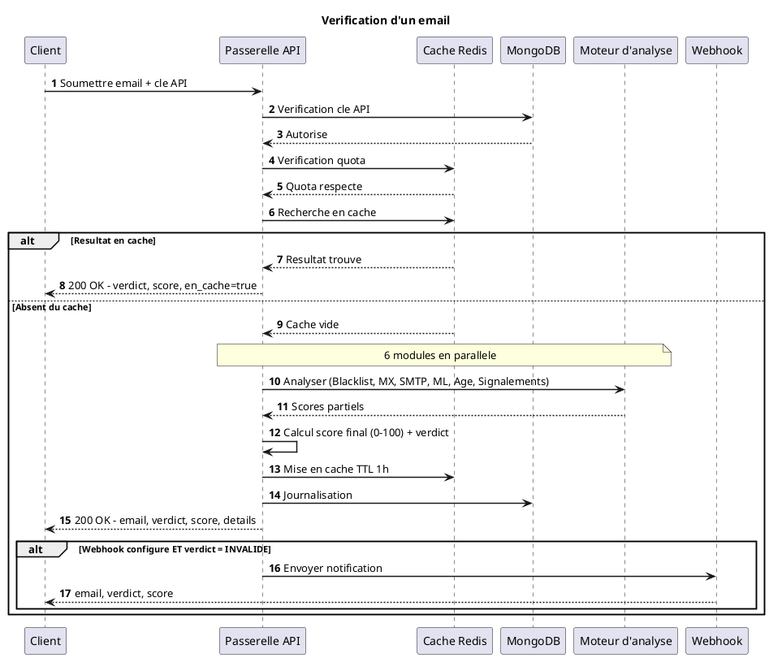
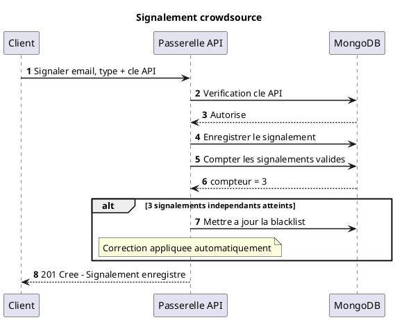
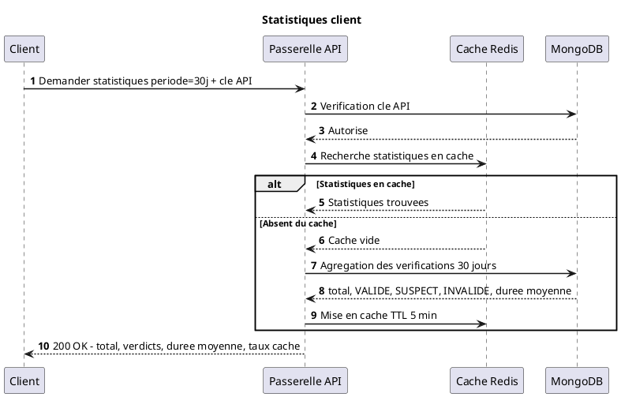

# Diagrammes de Sequence — MailGuard

---

## Sequence 1 — Verification d'un email

```plantuml
@startuml sequence-verify
title Verification d'un email

autonumber
skinparam sequenceArrowThickness 1.5
skinparam responseMessageBelowArrow true
skinparam backgroundColor #FFFFFF
skinparam defaultFontName Arial

participant "Client"           as C
participant "Passerelle API"   as GW
participant "Cache Redis"      as RC
participant "MongoDB"          as DB
participant "Moteur d'analyse" as AN
participant "Webhook"          as WH

C  ->  GW : Soumettre email + cle API

GW ->  DB : Verification cle API
DB --> GW : Autorise

GW ->  RC : Verification quota
RC --> GW : Quota respecte

GW ->  RC : Recherche en cache
alt Resultat en cache
    RC --> GW : Resultat trouve
    GW --> C  : 200 OK - verdict, score, en_cache=true
else Absent du cache
    RC --> GW : Cache vide

    note over GW,AN : 6 modules en parallele
    GW ->  AN : Analyser (Blacklist, MX, SMTP, ML, Age, Signalements)
    AN --> GW : Scores partiels

    GW ->  GW : Calcul score final (0-100) + verdict
    GW ->  RC : Mise en cache TTL 1h
    GW ->  DB : Journalisation

    GW --> C  : 200 OK - email, verdict, score, details

    alt Webhook configure ET verdict = INVALIDE
        GW ->  WH : Envoyer notification
        WH --> C  : email, verdict, score
    end
end

@enduml
```

---

## Sequence 2 — Signalement crowdsource

```plantuml
@startuml sequence-report
title Signalement crowdsource

autonumber
skinparam sequenceArrowThickness 1.5
skinparam responseMessageBelowArrow true
skinparam backgroundColor #FFFFFF
skinparam defaultFontName Arial

participant "Client"         as C
participant "Passerelle API" as GW
participant "MongoDB"        as DB

C  ->  GW : Signaler email, type + cle API
GW ->  DB : Verification cle API
DB --> GW : Autorise

GW ->  DB : Enregistrer le signalement
GW ->  DB : Compter les signalements valides
DB --> GW : compteur = 3

alt 3 signalements independants atteints
    GW ->  DB : Mettre a jour la blacklist
    note over GW : Correction appliquee automatiquement
end

GW --> C : 201 Cree - Signalement enregistre

@enduml
```

---

## Sequence 3 — Statistiques client

```plantuml
@startuml sequence-stats
title Statistiques client

autonumber
skinparam sequenceArrowThickness 1.5
skinparam responseMessageBelowArrow true
skinparam backgroundColor #FFFFFF
skinparam defaultFontName Arial

participant "Client"         as C
participant "Passerelle API" as GW
participant "Cache Redis"    as RC
participant "MongoDB"        as DB

C  ->  GW : Demander statistiques periode=30j + cle API
GW ->  DB : Verification cle API
DB --> GW : Autorise

GW ->  RC : Recherche statistiques en cache
alt Statistiques en cache
    RC --> GW : Statistiques trouvees
else Absent du cache
    RC --> GW : Cache vide
    GW ->  DB : Agregation des verifications 30 jours
    DB --> GW : total, VALIDE, SUSPECT, INVALIDE, duree moyenne
    GW ->  RC : Mise en cache TTL 5 min
end

GW --> C : 200 OK - total, verdicts, duree moyenne, taux cache

@enduml
```
